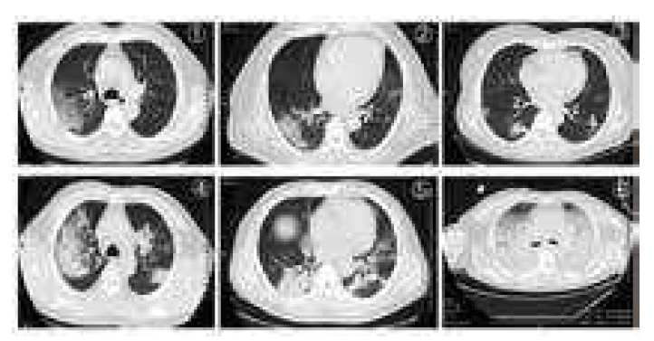

::: warning 警告：
- 因译者专业方向受限，各中术语无法识别判断正确性
- 所转译可能存在误差，建议与中国官方医学机构取得联系，获取更加精准的阅读物
- 以下内容为转译编写整理
:::

# 《新冠肺炎防治手册》

    <a href="javascript:void(alert('等待校验'))">todo校验</a> |
    <a target="_blank" href="https://www.alibabacloud.com/zh/universal-service/pdf_reader?spm=a3c0i.14138300.8102420620.dreadnow.16797c8eJFgfi8&cdnorigin=video-intl&pdf=%E5%9C%A8%E7%BA%BF%E9%98%85%E8%AF%BB%E6%96%B0%E5%86%A0%E8%82%BA%E7%82%8E%E9%98%B2%E6%B2%BB%E6%89%8B%E5%86%8C.pdf">原文@新冠肺炎防治手册</a> |
    <a target="_blank" href="/zh/handbook-of-covid-19-prevention-and-treatment.html">
        打印本文
    </a>
    |
    <a target="_blank" href="https://www.alibabacloud.com/zh/universal-service/pdf_reader?spm=a3c0i.14138300.8102420620.dreadnow.16797c8eJFgfi8&cdnorigin=video-intl&pdf=%E5%9C%A8%E7%BA%BF%E9%98%85%E8%AF%BB%E6%96%B0%E5%86%A0%E8%82%BA%E7%82%8E%E9%98%B2%E6%B2%BB%E6%89%8B%E5%86%8C.pdf">
        打印原文
    </a>

## 寄语
面对全新的未知病毒，共享与合作是最好的药方。

这本手册的出版，是对过去两个月医护人员体现出来的勇气与智慧的最好的纪念方式之一。

感谢所有参与编写人员，在救治病患的同时，把宝贵的经验汇编成册提供全球医疗同行借鉴。

感谢来自国内医疗同行的帮助，你们提供的经验对我们来说既是启发更是激励。

感谢马云公益基金会发起这个项目和阿里健康的技术支持，使得本手册能够为那些正与疫情搏斗的人们提供帮助。

本手册用于公益传播，由于时间仓促，书中难免会存在一些瑕疵和不足，欢迎读者批评指正。 

《新冠肺炎防治手册》主编

浙江大学医学院附属第一医院教授

## 前言

这是一场前所未有的战争，全球人类面对着同一个敌人———新型冠状病毒。第一战场是医院，而医务工作者是我们的战士。

要确保这场战争能赢，首先要确保我们的医务人员能得到足够的资源保障，包括技术和经验的输入。也要确保我们能让医院成为消灭病毒的战场，而不是被病毒击垮。

因此马云公益基金会和阿里巴巴公益基金会紧急召集了一批刚刚从“抗疫”战场回来的优秀医务人员，在浙江大学医学院附属第一医院的组织下，迅速出版了这本新冠肺炎
的临床救治经验，希望给全世界正在抗疫一线的和即将加入战争的各国医务人员一些建议和参考。

感谢浙江大学医学院附属第一医院的医务工作者，在冒着巨大风险救治新冠患者的同时，夜以继日亲自执笔写下了救治经验，形成这本手册。

过去的五十多天，浙大一院收治了104名确诊患者，其中重症和危重症患者78人。医务人员在巨大的压力和风险下，创造了三个零的奇迹：医务人员零感染，感染患者零漏诊和危重患者零死亡。

这是奇迹，更是财富。面对全新的疾病，作为最早遭遇疫情的中国，一切隔离、诊疗、防护和康复都是从零开始，但是我们希望因为这本手册的问世，至少其它国家的医生和护士
在走上这个特殊的战场时，可以有很多借鉴，不必从零开始。

这次的大流行，是全球化时代人类共同面临的一次挑战。此时此刻，只有不分你我，分享资源、经验和教训，才是我们赢得胜利的唯一机会。因为流行病最终的药方不是隔离，而是合作。

这场战争，才刚刚开始。

## 第一部分 防控管理

### 一. 隔离区域管理

#### 1. 发热门诊

##### 1.1 布局设置

1）医疗机构应设相对独立的发热门诊，医院入口处有发热门诊专用单向通道且有明显标识；

2）人员流向按照“三区两通道”原则，设有污染区、潜在污染区、清洁区，分区明确，污染区与潜在污染区之间设置两个缓冲区；

3）设置独立污物通道；设置可视传递间进行办公区（潜在污染区）向隔离病房（污染区）的单向物品传递；

4）应制定医务人员穿脱防护用品的流程、按区域步骤制作流程图和配置穿衣镜，严格遵守行走路线；

5）配备感染防控技术人员督导医务人员防护用品的穿脱，防止污染；

6）在污染区的所有物品未经消毒处理，不得带离污染区域

##### 1.2 分区设置

1）设置独立的检查室、化验室、留观室、抢救室、药房、收费处等；

2）设置预检分诊处，对患者做好初步筛查；

3）对诊疗区域进行分区：有流行病学接触史且伴有发热及或呼吸道症状，进入新冠疑似区域；无明确流行病学接触史的进入普通发热患者区域。

##### 1.3 患者管理

1）发热门诊患者必须佩戴医用外科口罩；

2）仅允许患者本人进入候诊区，减少人员聚集；

3）尽量减少发热门诊患者等候时间，避免交叉感染；

4）做好患者及家属宣教，提早识别症状并采取基本预防措施。

##### 1.4 筛查、收治及排除

1）所有医务人员应掌握COVID-19流行病学特点与临床特征，按照诊疗规范标准（见表1）对患者进行筛查；

2）对符合疑似筛查标准的患者进行核酸检测；

3）对不符合疑似筛查标准的，如无明确流行病学史，但症状尤其是影像学不能排除者，建议专家会诊后综合判断；

4）首次核酸检测结果为阴性的间隔24小时复测，两次阴性且临床表现可排除的，予以出院。临床表现不可排除的，继续间隔24小时持续复测，直至排除或确诊；

5） 确诊病例应定点集中收治，并评估病情严重程度（普通隔离病房收治或重症监护隔离病房收治）。

<h3 align="center">表1 COVID-19疑似病例筛查标准表</h3>

<table>
<tr>
<th>流行病学史</th>
<td>

①发病前14天内，有病例高发地区或国家旅行史或居住史；

②发病前14天内，与新型冠状病毒感染者（核酸检测阳性者）有接触史；

③发病前14天内，曾接触过来自病例高发地区或国家的发热或有呼吸道症状的患者；

④ 聚集性发病（2周内在小范围如家庭、办公室、学校班级等场所，出现2例及以上发热和/或呼吸道症状的

</td>
<td rowspan="2">
符合任1条无流行病学史，且符合任2 3条临床表现
</td>
<td rowspan="2">
无流行病学史，符合1-2条临床表现，但影像不能排除
</td>
</tr>
<tr>
<th>临床表现</th>
<td>
① 发热和/或呼吸道症状；
② 具有以下肺炎影像学特征：早期呈现多发小斑片影及间质改变，以肺外带明显。进而发展为双肺多发磨玻璃影、浸润影，严重者可出现肺实变，胸腔积液少见；
③ 发病早期白细胞总数正常或降低，或淋巴细胞计
</td>

</tr>
<tr>
<th></th>

<td>是否为疑似</td>
<td>是</td>
<td>专家会诊</td>

</tr>
</table>

#### 2. 隔离病区

##### 2.1 适用范围

包括隔离留观病区、隔离病区、隔离重症监护病区。建筑布局和工作流
程应符合医院隔离技术规范等有关要求。设置负压病区的医疗机构应按
相关要求实施规范管理。严格限制人员出入。

##### 2.2 布局设置

参照发热门诊

##### 2.3 病室要求

1）疑似患者和确诊患者分病区安置；

2）疑似患者单人单间，病室内配备有独立卫生间等生活设施，确保患
者活动范围固定于隔离病室内；

3）确诊患者可同病室安置，床间距≥1.2米，病室内配备有独立卫生间
等生活设施，确保患者活动范围固定于隔离病室内。

##### 2.4 患者管理

1）谢绝家属探视和陪护，患者可携带电子通信设备与外界沟通；

2）开展就诊患者教育，使其了解新冠病毒的防护知识，指导其佩戴外
科口罩、正确洗手、咳嗽礼仪、医学观察和居家隔离等。

### 二. 工作人员管理

##### 3.1 工作管理

1）工作人员进入隔离区域前，对穿脱个人防护用品必须经过严格培训和
考核，合格后才能进入；

2）工作人员实行小组制模式。组内人员分时段进入隔离区域（污染区），

3）集中安排治疗、检查、消毒等工作，减少工作人员进出隔离病房频率；

4）下班前应当进行个人卫生处置，并注意呼吸道与黏膜的防护。

##### 3.2 健康管理

1）隔离区域一线工作人员（医护、医技、物业后勤）统一安排隔离住宿，不得
自行外出；

2）提供营养膳食，增强医务人员免疫力；

3）为所有上岗的员工建立健康档案，一线工作人员主动开展健康监测，包
括体温和呼吸系统症状等；联合专家协助解决各种心理、生理问题；

4）如出现发热等不适，应立即进行单独隔离，并进行新冠病毒核酸检测排查；
建议每次在隔离区域时间一般不超过4小时；

5）隔离区域一线工作人员需结束隔离区工作的，应进行新冠病毒核酸检
测，为阴性后定点集中隔离14天，方可解除医学观察。

### 三. COVID-19相关个人防护管理

<table>
<tr>
<th width="100">防护等级</th>
<th width="200">防护用品</th>
<th>适用范围</th>
</tr>
<tr>
<th>一级防护</th>
<td>

- 一次性工作帽
- 一次性外科口罩
- 工作服
- 必要时戴一次性乳胶手套
- 或（及）穿一次性隔离衣

</td>
<td>

- 预检分诊、普通门诊

</td>
</tr>

<tr>
<th>二级防护</th>
<td>

- 一次性工作帽
- 医用防护口罩(N95)
- 工作服
- 一次性医用防护服
- 一次性乳胶手套
- 护目镜

</td>
<td>

- 发热门诊
- 隔离病区（含重症监护病区）
- 疑似/确诊患者非呼吸道标本检验
- 疑似/确诊患者影像学检查
- 疑似/确诊患者手术器械的清洗

</td>
</tr>
<tr>
<th>三级防护</th>
<td>

- 一次性工作帽
- 医用防护口罩(N95)
- 工作服
- 一次性医用防护服
- 一次性乳胶手套
- 全面型呼吸防护器或正压式头套

</td>
<td>

- 疑似/确诊患者可能发生呼吸道
 分泌物、体（血）液喷射或飞溅
 的工作时（如气管插管、气管切
 开、纤维支气管镜、胃肠镜等）
- 为确诊/疑似患者实施手术、尸检
- 新冠核酸检测

</td>
</tr>

</table>

备注：

1. 所有医疗场所工作人员均佩戴医用外科口罩；

2. 急诊、感染科门诊、呼吸科门诊、口腔科、普通内镜检查（如胃肠镜、纤维支气管镜、
喉镜等）工作人员在一级防护的基础上，医用外科口罩升级为医用防护口罩（N95)；

3. 疑似/确诊患者呼吸道标本采集时二级防护基础上戴防护面屏。

### 四. COVID-19疫情期间院感流程

#### 1. COVID-19相关个人防护用品穿脱流程

穿个人防护用品：

更换专用工作服、工作鞋 —— 执行手卫生 —— 戴一次性帽子 —— 戴医用防护口罩（N95）—— 戴里
层一次性丁腈手套/乳胶手套——戴护目镜，穿防护服（备注：对于无脚套防护服，加穿防水靴
套），穿一次性隔离衣（根据需要），戴面屏/正压呼吸头罩（根据需要）——戴外层一次性乳胶手套

脱个人防护用品：

手卫生，去除外表面肉眼可见血体液污染物 —— 手卫生，更换外层手套 ——摘去正压呼吸头罩或自
吸过滤式全面罩/面罩（根据需要）——手卫生——脱一次性隔离衣，连外层手套（根据需要）——
手卫生，戴外层手套 —— 进入缓冲区 ① —— 手卫生，脱防护服，连外层手套（里面反转在外，往
下卷）（备注：如有防水靴套，一并脱去）—— 手卫生 —— 进入缓冲区 ② —— 手卫生，摘除护眼
罩 —— 手卫生，摘口罩 —— 手卫生，摘帽子 —— 手卫生，脱里层一次性乳胶手套 ——手卫生，
离开缓冲区 ② —— 手卫生，沐浴更衣，进入清洁区

#### 2. 隔离病区环境消毒流程

##### 2.1 地面、墙壁的消毒

1）有肉眼可见污染物时，应先完全清除污染物（按血液体液等溢出处理）；

2）用1000mg/L含氯消毒液拖地、喷洒或擦拭消毒；

3）消毒作用时间不少于30分钟；

4）每日三次，有污染时随时消毒。

##### 2.2 物体表面的消毒

1）有肉眼可见污染物时，应先完全清除污染物（按血液体液等溢出处理）；

2）用`1000mg/L`含氯消毒液或含氯消毒湿巾擦拭，作用 30 分钟后清水擦拭干净，每日
三次（如有污染时随时消毒）；

3）擦拭时应按从洁到污的顺序：先擦接触较少的物体表面，再擦拭经常接触的物体表

面（擦完一个物表更换一块湿巾）。

##### 2.3 空气消毒

1）等离子空气消毒机可以在有人环境下使用，可持续运行进行空气消毒；

2）无等离子空气消毒机，也可以使用紫外线灯消毒，照射时间1小时，每日三次。

##### 2.4 排泄物及污水处置

1）在进入市政排水管网前需进行消毒处理，定时投加含氯消毒剂，（初次投加，有效
氯`40mg/L`以上），并确保消毒1.5小时；

2）消毒后污水应当符合医疗机构水污染物排放标准，总余氯量达`10mg/L`。

#### 3. COVID-19患者血液体液呕吐物等溢出处理流程

##### 3.1少量(<10mL)血液体液溢出

1）方案一：含氯消毒湿巾(含有效氯5000mg/L)覆盖作用后去除污
染物，再用含氯消毒湿巾(含有效氯5000mg/L)擦拭2遍；

2）方案二：用一次性吸水材料如纱布、抹布等，沾取5000mg/L的
含氯消毒液，小心移除。

##### 3.2大量(>10mL)血液体液溢出

1）首先放置好隔离标识；

2）采用方案一或方案二执行操作：

①方案一：用清洁吸附巾(含过氧乙酸，每张可吸附1L)吸附溢出液
体，作用30分钟，去除污染物后进行清洁；

②方案二：使用含吸水成分的消毒粉或漂白粉完全覆盖，或用一次
性吸水材料完全覆盖后用足量的10000mg/L的含氯消毒液浇在吸水
材料上(或采用能达到高水平消毒的消毒干巾)，作用30分钟以上，
小心清除干净。

3）患者溢出的排泄物、分泌物、呕吐物等采用专门容器收集，用含
20000mg/L含氯消毒剂，按污染物、消毒剂比例1:2浸泡消毒2小时；

4）清除污染物后，对污染的环境物体表面进行消毒；

5）盛放污染物的容器可用含有效氯5000mg/L的消毒剂溶液浸泡消
毒30分钟，然后清洗干净；

6）清理的污染物按医疗废物集中处置；

7）使用后物品均放入双层医疗废物垃圾袋，按医疗废物处理。

#### 4. COVID-19相关可复用医疗器械消毒

##### 4.1 正压头套消毒

备注：以上头罩部分的消毒流程仅针对可复用头罩（一次性头罩除外）。

##### 4.2 消化内镜及支气管镜清洗消毒处理流程

1）将内镜及复用按钮放入0.23%过氧乙酸水槽中（测试消毒液浓度，
确保有效使用）；

2）连接内镜各通道灌流管路，用50毫升注射器往管路里注入0.23%过
氧乙酸液体，使之充分充盈，静置5分钟；

3）卸除灌流管路，用一次性内镜专用清洗刷刷洗内镜各腔道及按钮；

4）按钮放入含酶超声波震荡仪震荡，内镜连接各通道灌流管路，用50
毫升注射器往管路里注入0.23%过氧乙酸液体，持续冲洗5分钟，注入
空气干燥1分钟；

5）用50毫升注射器往管路里注入清水，持续冲洗3分钟，注入空气干
燥1分钟；

6）进行内镜的泄露测试；

7）放入全自动内镜洗消机，设置高水平消毒进行处理；

8）送消毒供应中心，环氧乙烷灭菌。

4.3其他可复用医疗器械预处理

1）无明显污染物时先用含氯消毒剂1000mg/L浸泡至少30分钟；

2）有明显污染物时用含氯消毒剂5000mg/L浸泡至少30分钟；

3）干燥后，密闭打包送消毒供应中心。

#### 5. COVID-19相关感染性织物消毒流程

##### 5.1 感染性织物

1）患者使用的衣物、床单、被套、枕套；

2） 病区床帘；

3） 环境清洁使用的地巾。

##### 5.2 收集方法

1） 第一层用一次性水溶性塑料袋包装，用配套扎带封装；

2） 第二层用塑料袋包装，用鹅颈式封口，用扎带封装；

3） 最后装黄色织物袋用扎带封口；

4） 贴特殊感染标识及科室名称，送洗衣房。

##### 5.3 存储和洗涤

1） 注意与其他感染性织物（非新冠）分开存放，专机洗涤；

2） 使用含氯消毒剂洗涤消毒，温度90度，时间不少于30分钟。

##### 5.4 运输工具消毒

1） 运输工具专用；

2） 运送感染性织物后一用一消毒；

3） 采用有效氯`1000mg/L`含氯消毒液擦拭，作用30分钟后，清水擦拭干净。

#### 6. COVID-19相关医疗废物处理流程

1）疑似或确诊患者所有的废弃物都应视为医疗废物；

2）产生的医疗废物放入双层医疗废物袋，鹅颈式封口，扎带封装，喷洒含
`1000mg/L`含氯消毒液；

3）利器置入塑料利器盒内，封口后喷洒含`1000mg/L`含氯消毒液；

4）置入医疗废物转运箱，上贴特殊感染标识，密闭转运；

5）专人定时按指定路线回收至医废暂存点，定点单独存放；

6）由医疗废物回收机构回收处置。

#### 7. COVID-19相关工作人员职业暴露处理流程

1）皮肤暴露：被大量肉眼可见的患者体液、血液、分泌物或排泄物等污物直接
污染皮肤；

2）粘膜暴露：被肉眼可见的患者体液、血液、分泌物或排泄物等污物直接污
染粘膜（如眼睛、呼吸道）；

3）锐器伤：被直接接触了确诊患者体液、血液、分泌物或排泄物等污物的锐
器刺伤；

4）呼吸道直接暴露：在未戴口罩的确诊患者1米范围内口罩脱落，暴露口或鼻。

##### 8. COVID-19患者相关手术感控流程

##### 8.1 手术室环境及人员防护要求

1）安排在负压手术室。提前开启负压手术室，保持合适温度、湿度及负压；

2）备齐手术必需物品，尽量使用一次性的手术物品；

3）所有进入手术间参与手术人员（包括手术医生、麻醉医生、洗手护士、手术室巡回
护士）均在缓冲间穿戴好防护用品：戴双层帽子，医用防护口罩，医用护目镜，医用防护
服，靴套，乳胶手套，正压头套；

4）手术操作人员及洗手护士在以上基础上穿戴一次性无菌手术衣、无菌手套；

5）患者根据情况可戴一次性帽子及一次性外科口罩；

6）缓冲间巡回护士在负压手术间缓冲区内负责物品传递；

7）手术期间，关闭缓冲间及手术间门，手术间达到负压状态方可实施手术；

8）杜绝无关人员进入该手术间。

#### 8.2 手术后的终末消毒处理流程

1）医疗废物：按新冠相关医疗废物处理；

2）可复用医疗器械：按新冠相关可复用医疗器械消毒流程消毒处理；

3）医用织物：按新冠相关感染性织物消毒流程消毒处理；

4）物体（器械台、操作台、手术床等仪器设备）表面：

①有肉眼可见血液、体液污染时，应先完全清除污染物再消毒（按血液体液等溢出处理）；
②无肉眼可见污染物时，使用含1000mg/L有效氯的消毒剂擦拭保持作用30分钟；

5）地面、墙壁：
①有肉眼可见血液、体液污染时，应先完全清除污染物再消毒（按血液体液等溢出处理）；
②无肉眼可见污染物时，使用含1000mg/L有效氯的消毒剂擦拭保持作用30分钟；

6）室内空气：关闭层流、送风；使用紫外线灯照射消毒至少1小时；再开启机组自净至少2小时。

#### 9. COVID-19疑似/确诊患者尸体处理流程

1）个人防护：工作人员做好个人防护：穿戴工作服、一次性工作帽、一
次性手套和长袖加厚橡胶手套、医用一次性防护服、医用防护口罩或动
力送风过滤式呼吸器、防护面屏、工作鞋或胶靴、防水靴套、防水围裙
或防水隔离衣等；

2）尸体护理：用`3000-5000mg/L`的含氯消毒剂或0.5%过氧乙酸棉球或
纱布填塞患者口、鼻、耳、肛门、气管切开处等所有开放通道或创口；

3）包裹：用浸有消毒液的双层布单包裹尸体，装入双层密闭防渗漏含氯
消毒液的尸体包裹单；

4）由医院隔离病区工作人员经污染区至专用电梯送出病区，派专用车辆
直接送至指定地点尽快火化；

5）终末消毒：病室及电梯进行终末消毒。

### 五．数字化支撑疫情防控

#### 1. 降低患者就诊交叉感染风险

1）提供并引导公众利用互联网医院功能处理慢病等非紧急医疗需求，减
少实体医院人流量，降低就诊的交叉感染风险；

2）对于必须前往医院的患者，通过互联网医院精确预约就诊时段，给予
交通、停车、到达时间、防护措施、分诊信息、室内导航等必要的指
导，并提前在线做好患者的全面资料收集，提高诊疗效率，减少患者在
医院滞留时间；

3）引导患者充分利用数字化自助设备，减少人群接触，降低交叉感染风险。

#### 2. 降低医务人员工作强度和感染风险

1）通过远程会诊、远程MDT，汇聚专家智慧，给疑难病症以最佳治疗方案；

2）利用移动查房和远程查房，减少医务人员不必要的暴露风险，降低工
作强度，节约防护物资；

3）通过电子健康码和提前推送的在线流行病学调查问卷，掌握患者最新
的健康状况，一方面指导患者，特别是发热或疑似患者有效分流就诊；
另一方面，保证医务人员在各个业务节点均能提前识别患者健康状况，
有效防范感染风险；

4）利用发热门诊患者专科电子病历和新冠肺炎CT影像AI系统，降低工作
强度，快速识别疑似患者，减少漏诊。

#### 3. 快速响应抗疫紧急需求

1）基于云医院系统弹性扩展业务所需的数字化基础资源，即时部署疫情应急响应所需
的信息系统，例如新设立的发热门诊、发热留观室和隔离病房等抗疫专设部门所需的数
字化系统；

2）利用互联网架构的医院信息系统，一方面实现医务人员在线培训并一键部署使用系
统，另一方面方便系统运维人员实时远程维护，快速发布业务所需新功能。

【浙一互联网医院—互联网医疗典范】

自疫情发生以来，浙一互联网医院快速加入浙江省互联网医院新冠肺炎义诊通道，开
设专家团队义诊，提供24小时免费在线答疑，为全国乃至全球的患者提供远程医疗服
务，让患者足不出户就能享受到浙大一院优质医疗服务，也减少了因为就医而引起的
疫情播散和院内交叉感染。截至3月14日，浙一互联网医院共在线服务患者逾万人。

● 浙江省互联网医院使用说明

①下载支付宝APP；

②打开支付宝（国内版）便可进入“浙江省互联网医院平台”；

③选择医院(浙江大学医学院附属第一医院)；

④咨询申请，等待接诊；

⑤医生接诊后会有消息提醒，打开支付宝，点击【朋友】-【生活号】；

⑥点击【浙江省互联网医院平台】，进入查看详情，进入咨询。

【构建浙大一院国际医生交流平台实践】

随着疫情发展，为了提高国际救治水平，浙大一院联合阿里巴巴创建了 “浙大一院国
际医生交流平台”，通过在线实时多语言翻译、远程音视频会议等功能实现国内外医
生的即时抗疫经验交流，达到全球信息资源共享。

●浙大一院国际医生交流平台使用说明

①登录www.dingtalk.com/en下载钉钉；

②注册账号并登录；

③申请加入“浙大一院国际医生交流平台”；

方式一：点击【通讯录】-【加入企业/组织/团队】-输入团队号【YQDK1170】

方式二：扫描浙大一院二维码

④填写姓名、所在国家、医疗机构名称加入；

⑤浙大一院管理员批准后，按照需求加入对应交流群；

⑥国外用户进入交流群后，可实现【图文信息交流AI辅助】、【远程音频指导】、【诊疗指南文件阅读】。

## 第二部分 诊疗经验

### 一. 多学科协作个性化治疗

浙大一院收治的主要是重型及危重型COVID-19患者，病情变化快，常累及多器官，需要多学科协助，医院整合感染科、呼吸内科、ICU、检验科、放射科、
超声医学科、药学部、中医科、精神卫生科、呼吸治疗科、康复医学科、营养科、护理部等各专科力量组成COVID-19专家团队，建立完善的多学科协作诊
疗（MDT）机制，每日进行研讨，隔离病区医生通过互联网视频参与一起讨论，协同诊治，为每位重型、危重型患者制订科学、系统、个性化的治疗方案。

科学决策是MDT的核心。讨论中既要发挥各学科专家的领域优势，又需集中和聚焦诊疗中的关键问题，出现多种意见与建议时，需要能把控全局、经验丰富
的专家进行整合，确定最终治疗方案。

系统分析是MDT的关键。高龄的、存在基础疾病的患者容易进展为危重症，在关注COVID-19疾病演化同时，患者的基础状况、合并症、并发症、每日的检
验检查结果要做综合分析，研判病情趋势，做好提前干预，阻断疾病进展，抗病毒、氧疗、营养支持等措施要积极。

个性化诊治是MDT的结果。治疗方案要做到因人施策、精准施策，充分考虑不
同个体、不同病程、不同类型的患者治疗上的差异性。

我们的经验是多学科协作诊治机制可以有效提高COVID-19的诊治效果。

### 二. 病原学与炎症指标检查

#### 1. SARS-CoV-2核酸检测

##### 1.1标本采集

选择合适的标本类型、正确的采集方法和时机对提高检测灵敏度十分重要。标本类型
包括：上呼吸道标本（咽拭子、鼻拭子、鼻咽抽取物）、下呼吸道标本（痰液、气道
抽取物、肺泡灌洗液）、血液、粪便、尿液和结膜分泌物等。痰等下呼吸道标本检出
核酸阳性率高，应优先采集。`SARS-CoV-2`在Ⅱ型肺泡细胞（`AT2`）中增殖，其释放峰
值（peak of viral shedding）出现在发病后3~5d。因此，发病初期如核酸检测阴性，
应连续随访采样检测，核酸阳性率会明显提高。

##### 1.2核酸检测

核酸检测是诊断`SARS-CoV-2`感染的首选方法。根据试剂盒说明书进行，一般过程：痰
标本等经过前处理，并裂解病毒提取核酸，再用实时（real-time）荧光定量`PCR`技术
扩增`SARS-CoV-2`的3个特异性基因：开放读码框架1a/b（ORF1a/b）、核壳蛋白
（N）及包膜蛋白（E）基因，检测扩增后荧光强度获得结果。核酸阳性判断标准：
`ORF1a/b`基因阳性，和/或N基因、E基因阳性。

多种类型标本联合检测核酸有利于提高诊断阳性率。在呼吸道标本核酸阳性的确诊患
者中，约30%-40%的患者可在其血液中检测到病毒核酸；约50%-60%的患者可在粪便
中检测到病毒核酸；尿液标本核酸检出阳性率很低。呼吸道标本、粪便、血液等多种
类型标本联合检测有利于提高疑似病例的诊断灵敏度、患者疗效观察和制定合理的出
院后隔离管理措施。

#### 2. 病毒分离培养

病毒培养必须在获得资格的生物安全三级（BSL-3）实验室开展。简要过程：留取患者
痰液、粪便等新鲜标本，接种于Vero-E6细胞进行病毒培养，96h后观察细胞病变效应
（CPE），并检测培养液病毒核酸阳性即提示培养成功。病毒滴度测定：将病毒原液按
10倍系列稀释后，采用微量细胞病变法测定`TCID50`，或采用蚀斑试验计数蚀斑形成单
位（plaque forming unit，PFU）测定病毒感染活力。

#### 3. 血清抗体检测

`SARS-CoV-2`感染后会产生特异性抗体。血清抗体测定方法有：胶体金免疫层析法、
ELISA、化学发光免疫分析等。患者血清特异性IgM阳性，或恢复期特异性IgG抗体滴
度较急性期升高4倍及以上，可作为核酸检测阴性疑似患者的诊断依据。通过随访监
测，发现在患者发病后10天可检出IgM，发病后12天检出IgG，并随着血清抗体水平升
高，病毒核酸载量逐渐下降。

#### 4. 炎症反应指标的检测
建议开展C反应蛋白、降钙素原、铁蛋白、D-二聚体、淋巴细胞总数及
亚群、IL-4、IL-6、IL-10、TNF-α、INF-γ等反应机体炎症与免疫状态
的检查，有助于判断临床进程，预警重症、危重症倾向，并为治疗策
略制订提供依据。

大多数新冠肺炎患者降钙素原正常，C反应蛋白显著升高，C反应蛋白
迅速大幅升高提示可能出现继发感染。重症患者D-二聚体水平显著升
高，是患者预后不良的潜在危险因素。发病初期淋巴细胞总数较低的
患者一般预后较差，且重症患者外周血淋巴细胞数量呈进行性减少。
重症患者IL-6、IL-10表达水平显著上升，监测IL-6、IL-10水平有助于
评估患者重症化风险。

#### 5. 继发细菌真菌感染的检测

重症、危重症患者易继发细菌、真菌感染。根据感染部位采集合格标
本进行细菌、真菌培养。怀疑肺部继发感染，宜采集深部痰标本、气
管吸出物、肺泡灌洗液和毛刷标本等进行培养。高热患者应及时进行
血培养。留置导管的疑似脓毒症患者，同时送检外周静脉血和导管血
进行培养。怀疑真菌感染患者，除真菌培养外，还建议至少每周两次
送检血液G试验和GM试验。

#### 6. 实验室安全防护

应依据不同的实验操作风险程度确定生物安全防护措施。呼吸道标本
采集、核酸检测和病毒培养等操作，个人防护应按照BSL-3级实验室防
护要求。血常规、生化、免疫检验等常规检验操作，个人防护应按照
BSL-2级实验室防护要求。标本运送应采用符合生物安全要求的专用运
输罐和运输箱。所有实验室废弃物均应严格高压消毒处理。

### 三. COVID-19患者肺部影像学表现

肺部影像学检查在COVID-19诊断、疗效监测及出院评估中具有重要价值。检查方法首选肺部高分辨率CT；对于不便搬动的危重型患者，可选择床旁X线检
查。一般于入院当日行基线肺部CT检查，若治疗后疗效不理想，2~3d后可复查肺部CT；治疗后症状稳定或好转，可5~7d后复查；危重型患者须每日复查床边胸片。

COVID-19患者肺部CT早期多表现为位于肺外带、胸膜下、下叶分布的多发性斑片状磨玻璃阴影，病灶长轴多与胸膜平行；部分磨玻璃样病灶内可见小叶间
隔增厚和小叶内间隔增厚，呈细小网格状，为“铺路石征“；少数病例可表现为单发、局部病变，或表现为沿支气管分布、伴周边磨玻璃样改变的结节/斑片
状病灶。病情进展多发生在病程7-10天，可表现为病灶范围扩大，大片肺实变，内可见支气管充气征。危重症患者可表现为实变范围进一步扩大，全肺密
度增高实变，呈“白肺”征像。病情缓解后，磨玻璃样阴影可完全吸收，部分实变病灶会遗留条索样或网格样纤维化病灶。对于病变累及多叶，尤其是动态
观察发现病灶范围增大者，须警惕疾病加重。具备典型肺部CT表现者，即使核酸检测阴性，亦应隔离并连续行核酸检测(见图1-6）。

COVID-19肺CT典型表现：图1、图2 磨玻璃渗出；图3 结节及斑片状渗出；图4、图5 肺实变；图6 广泛实变，表现为“白肺”

### 四. COVID-19患者诊治中支气管镜技术的应用

支气管镜技术在COVID-19患者诊治中具有以下价值：

1）留取深部气道标本，提升病毒核酸检出阳性率及病原体培养准确率，合理指导抗菌药物应用；

2）吸痰，清除血痂，解除气道梗阻；

3）协助建立人工气道，引导气管插管或经皮气管切开；

4）气道内给药，如滴注α-干扰素、N-乙酰半胱氨酸。危重症患者气管镜下可见支气管粘膜广泛充血肿胀，管腔内大量粘液样分泌物潴留，严重者可见粘稠胶冻样痰液堵塞气道，见图7。

图7 COVID-19气管镜下表现：支气管粘膜肿胀充血；管腔内见大量粘液样分泌物

### 五. COVID-19诊断与临床分型

临床上应做到早诊断、早治疗、早隔离。动态观察肺部影像、氧合指数、细胞因子水平，早期发现有重症、危重症倾向的患者。SARS-CoV-2核酸阳性是
COVID-19确诊的金标准，但核酸检测存在假阴性现象，因此对于肺部CT高度疑似COVID-19者，即使核酸检测阴性，可先按临床诊断病例处理，进行隔离
治疗并连续进行标本联合送检。

COVID-19诊断标准遵循我国新冠病毒肺炎诊疗方案，综合流行病学史（包括聚集性发病）、临床症状（发热和呼吸道症状）、肺部影像、SARS-CoV-2核
酸检测、血清特异性抗体等因素来明确诊断。

**临床上分为：**

**轻型**，临床症状轻微，影像学未见肺炎表现;

**普通型**，具有发热、呼吸道等症状，影像学可见肺炎表现;

**重型**，成人符合下述任何一条者：呼吸频率≥30次/min；或静息状态下指氧饱和度≤93%；或者动脉血氧分压（PaO2）/吸氧浓度（FiO2）≤300mmHg；
肺部影像学显示24-48小时内病灶明显进展＞50%者按重型管理;

**危重型**，符合以下情况之一者：出现呼吸衰竭且需要机械通气；或者出现休克；或者合并其他器官功能衰竭需ICU监护治疗。

针对危重型，我们根据氧合指数、呼吸系统顺应性等情况，进一步分为早期、中期、晚期。

**●早期**：100mmHg<氧合指数≤150mmHg，呼吸系统顺应性≥30mL/cmH2O，未合并肺以外脏器功能衰竭的，通过积极抗病毒、抗细胞因子风暴、对症支持处理，恢复机会较大。

**●中期**：指氧合指数60mmHg<氧合指数≤100mmHg，30mL/cmH2O>呼吸系统顺应性≥15mL/cmH2O，可同时合并其他脏器功能轻中度受损。

**●晚期**：指氧合指数≤60mmHg，呼吸系统顺应性<15mL/cmH2O两肺弥漫性实变，需要人工膜肺支持，或出现其他重要脏器功能衰竭的，死亡风险显著提高。

### 六. 抗病毒治疗及时消除病原体

抗病毒治疗越早越好，可以减少重症、危重症的发生。COVID-19虽然缺乏有明确
临床证据的有效抗病毒药物，根据我国新冠病毒肺炎诊疗方案，结合冠状病毒结构特
征，现阶段我们采取的抗病毒策略如下：

#### 1. 抗病毒方案

我们以洛匹那韦/利托那韦片2片po q12h联合阿比多尔片200mg po tid作为基础方
案；使用该方案，49例患者出现第一次病毒核酸检测阴性平均时间为12d（95%可信
区间8～15d），持续病毒核酸检测阴性时间（持续2次以上病毒核酸检测阴性且两次
间隔24h）为13.5d（95%可信区间9.5～17.5d）。

基础方案效果不佳，可以尝试使用磷酸氯喹（18岁-65岁成人。体重>50公斤者，每次500mg bid；体重<50公斤者，第一、二天每次500mg bid，第三至
第七天每次500mg qd）。

我国新冠病毒肺炎诊疗方案推荐使用干扰素雾化吸入治疗，我们建议在负压病房进行。因雾化易诱发气溶胶播散，不建议普通病房内开展雾化吸入治疗。

根据艾滋病患者用药经验，达芦那韦/考比司他的不良反应相对较轻，体外病毒抑制试验具有一定程度抗病毒活性，对不耐受洛匹那韦/利托那韦的患者，
在通过伦理审查后可考虑口服达芦那韦/考比司他（1片 qd）或者法匹那韦（首剂1600mg，后续600mg tid）代替。不建议同时应用3种及以上抗病毒药物。

#### 2. 疗程

磷酸氯喹疗程≤7天；其他方案的疗程尚未确定，一般为2周，或痰液病毒核酸检测结果持续3次以上阴性可考虑停用抗病毒药物。

### 七. 抗休克及抗低氧血症维持生命体征

COVID-19从重型向危重型发展时，患者可出现严重低氧血症、细胞因子风暴、继发重型感染，进而发生休克，出现组织灌注障碍，甚至多器官功能衰竭，
治疗上以纠正诱发因素和液体复苏为主。人工肝血液净化系统可迅速清除炎症介质，消除细胞因子风暴，可阻断休克和低氧血症、呼吸窘迫的发生。

#### 1. 酌情使用糖皮质激素

对于重型、危重型，早期、适量、短程糖皮质激素治疗既有利于控制细胞因子炎症风暴，阻止病情进展，缩短病程，又可避免长期大量使用糖皮质激素导
致的不良反应和并发症。

##### 1.1 适应证

①符合重型、危重型诊断者可早期使用；
②高热（体温超过39℃）持续不退；
③影像学提示受累肺叶面积大（30%以上肺叶受累），有磨玻璃渗出；
④肺部影像学表现进展迅速且受累面积明显增多（48h复查肺部CT提示进展超过50%）；
⑤IL-6≥5倍正常值上限。

##### 1.2 使用方法

根据炎症损伤程度，甲泼尼龙琥珀酸钠（甲强龙）常规起始剂量每天0.75~1.5mg/kg
分1~2次静脉注射；对于常规剂量不能控制体温，或者细胞因子仍然显著升高的重症
患者可以考虑40mg q12h，危重症患者可以使用40mg-80mg q12h。治疗期间，密
切监测体温、血氧饱和度，每隔2~3d复查血常规、C反应蛋白、细胞因子、生化指
标、血糖、肺部CT等评估病情及疗效。如病情改善，体温正常，或肺部影像有吸收，
则每3~5d激素减半，减至每日20mg/d后序贯甲泼尼龙（美卓乐）口服,根据病情确定
疗程。

##### 1.3 治疗期间注意事项

①治疗前完善结核菌感染T细胞斑点（T-SPOT）试验、乙型肝炎病毒和丙型肝炎病毒标志物等检测，避免在激素治疗过程中激活潜在感染；
②根据情况应用质子泵抑制剂、钙剂预防并发症；
③监测血糖，一旦出现血糖升高，皮下注射胰岛素控制血糖；④监测血钾，纠正低钾血症；
⑤监测肝功能，及时进行护肝治疗；
⑥出现多汗、自汗者，可试用中药；
⑦出现兴奋、睡眠障碍者，临时给予镇静催眠药。

#### 2. 人工肝治疗消除细胞因子风暴

人工肝系统集成血浆置换、吸附、灌流，血液/血浆滤过等技术，用于清除炎症介质、内
毒素及中小分子有毒有害物质，补充白蛋白、凝血因子等有益物质，调节水电解质、酸
碱平衡；能阻断“细胞因子风暴”，纠正休克，减轻肺部炎症，改善呼吸功能；同时有
助于恢复机体免疫稳态、改善体内代谢紊乱状态、有利于容量精准管理、改善肝、肾等
多器官功能，以提高重型、危重型患者的救治成功率，降低病死率。

##### 2.1 适应证

①血炎症因子（如IL-6等）浓度≥正常上限5倍，或每日上升速度≥1倍；
②肺部影像学快速进展，CT或X线提示肺受累百分比每天进展10%或以上；
③基础疾病需要人工肝治疗患者；
符合①+②的患者，或符合③的患者。

##### 2.2 相对禁忌证

在危重型患者抢救中，无绝对禁忌证，但出现以下情况须谨慎使用：

①严重活动性出血或弥漫性血管内凝血者；
②对治疗过程中所用血制品或药品如血
浆、肝素和鱼精蛋白等严重过敏者；
③急性脑血管意外或严重颅脑损伤者；
④慢性心功能不全，心功能分级为Ⅲ级及以上者；
⑤尚未纠正的低血压、休克；
⑥严重的心律失常。

建议进行血浆置换联合血浆吸附或双重血浆分子吸附、灌流及滤过，血浆置换量建议
2000mL以上。具体操作方案请参考《人工肝血液净化系统应用于重型、危重型新型冠
状病毒肺炎治疗的专家共识》。

我院经过人工肝治疗的危重型患者， ICU 住院时间明显缩短； 血清细胞因子
IL-2/IL-4/IL-6/TNF-α水平显著下降，呼吸改善，氧饱和度提升。

#### 3. 氧疗纠正低氧血症

COVID-19呼吸功能受损以低氧血症最为突出。如何及时、有效地纠正
低氧血症、缓解患者呼吸窘迫和缺氧导致的继发器官损伤和功能障碍
对改善患者预后具有重要意义。

##### 3.1 氧疗

1）氧疗同时持续指氧饱和度监测

大多数患者初期氧合并不差，但部分患者氧合功能可能快速恶化。因
此，氧疗同时建议持续指氧饱和度监测。

2）氧疗时机

不吸氧情况下指氧饱和度（SpO2）>93%，且无明显呼吸窘迫症状时，
可不给予氧疗。部分COVID-19重型患者虽然PaO2/FiO2<300，但呼吸
窘迫症状却不明显，建议氧疗。

3）氧疗目标

建议维持氧饱和度目标SpO293%-96%。若合并慢性II型呼吸衰竭，降
低氧饱和度目标至SpO288%-92%；日常活动下SpO2频繁降至85%以
下时，提高氧浓度至92%-95%，监测PaCO2水平。

4）控制性氧疗

PaO2/FiO2是比较准确的评价氧合功能指标。若病情进展、PaO2/-
FiO2<300mmHg的患者，FiO2的稳定性、可监测性非常重要。推荐首
选控制性氧疗。

静息状态下SpO2 < 93% 、PaO2 / FiO2 < 300 mmHg  1mmHg=0.133kPa）、呼吸频率>25次/min或影像学表现进展明显时，建议
给予高流量吸氧(HFNC），患者佩戴外科口罩。对于PaO2/FiO2介于
200-300mmHg且患者无明显胸闷气促主诉时，HFNC的气流量应从低
水平开始，逐渐达到40-60L/min。对于明显呼吸窘迫的患者，可直接
给予60L/min的初始流量。

部分患者氧合指数较低（<100mmHg），但一般情况较好，对于这部分患者是否立即行气管插管，最重要的是关注原发病进展状况，综合评估患者全身状态、
代偿能力及疾病发展趋势。如果HFNC高流量（60L/min）高浓度吸入（>60%）1-2小时内患者氧合指数持续降低（<150mmHg）或呼吸窘迫症状明显加重或
合并其他脏器功能不全，尽早气管插管。

对于高龄（>60岁）合并症多或PaO2/FiO2<200mmHg的患者，建议收住重症医学科。

#### 3.2 机械通气

1）无创通气（Noninvasive Ventilation, NIV）

COVID-19部分重症患者可快速进展至ARDS，过高的通气驱动和NIV可能加重肺损伤。
NIV导致的胃肠胀气和患者不耐受可能引起吸入性肺炎。我们不推荐对HFNC治疗失败
的患者常规使用NIV。若患者合并急性左心衰竭或慢性阻塞性肺病或免疫抑制时，可短
期使用（不超过2h）并密切监测，若患者窘迫症状或PaO2/FiO2无明显改善，尽早气
管插管。

NIV建议使用双回路的呼吸机；使用单管路无创呼吸机时在面罩和呼出阀之间加装病毒
过滤器；选择合适型号的面罩，减少漏气导致的病毒播散风险。

2）有创机械通气（Invasive Mechanical Ventilation，IMV）

①COVID-19危重症患者有创机械通气的原则

在保障患者基本通气和氧合需求的同时如何降低机械通气相关性肺损伤在COVID-19患
者治疗过程中至关重要。

●严格限定潮气量4~8mL/kg理想体重。通常情况下，肺顺应性越低，预设的潮气量
也应越小;

●控制平台压<30cmH2O（1cmH2O=0.098kPa）、驱动压<15cmH2O;

●根据ARDSnet规范进行PEEP设定;

●通气频率18~25次/min，允许适度的高碳酸血症;

●潮气量过大、平台压和驱动压过高时，加强镇静镇痛、甚至给予肌肉松弛药。

②肺复张

肺复张可能改善ARDS患者肺病变的不均一性，但同时存在严重的呼吸、循环并发症。
我们不推荐常规使用肺复张手法；若要使用，首先进行肺可复张性评估。

3）俯卧位通气

COVID-19危重症患者大多对俯卧位通气有良好反应，氧合和肺部力学可在短时间内得到明显改善。我们建议对
PaO2/FiO2<150mmHg或影像表现较重的患者在无禁忌的情况下常规进行俯卧位通气，每次16小时以上。当仰卧位4小时以上患
者PaO2/FiO2仍>150mmHg时可暂停俯卧位通气。对于尚未插管、无明显呼吸窘迫但氧合较差、影像学表现为明显的肺重力依赖区实变的患者，可尝试清醒
俯卧位通气。每次持续4小时以上，根据效果和耐受性调整，每天可以反复多次俯卧位。

4）预防返流误吸

常规进行胃残余量和胃肠功能评估，尽早给予适量的肠内营养。推荐留置鼻肠管进行
空肠内营养、留置胃管进行持续减压；转运前停止肠内营养，50mL空针抽吸；无禁忌
时采用30°半坐位等。

5）液体管理

过多的液体输注常可显著加重COVID-19患者低氧血症。在保证患者循环灌注的情况下
应严格控制液体入量，对减少肺部渗出、改善氧合有积极作用。

6）呼吸机相关性肺炎（VAP）预防策略

①选择合适型号的气管插管；

②使用带声门下吸引的气管插管（q2h，每次20mL空针筒抽吸）；

③确保气管插管的位置、深浅合适，妥善固定、避免牵拉；

④维持气囊压力30~35cmH2O（1cmH2O=0.098kPa），q4h监测一次；

⑤涉及体位变动时进行气囊压力监测、冷凝水处理（双人配合倾倒，倒入预置含氯消毒液的加盖容器中）、气囊上分泌物处理；

⑥及时清理患者口鼻分泌物。

7）撤机拔管时机和策略

当患者PaO2/FiO2>150mmHg时，可积极减停镇静剂唤醒，条件允许尽早拔管；采用HFNC或NIV进行拔管后的续贯呼吸支持。

### 八. 抗继发感染合理使用抗菌药物

COVID-19是病毒感染性疾病，轻型及普通型患者不建议预防性使用抗菌药物；重
型患者需要结合具体情况谨慎决定是否预防性使用抗菌药物，对于病变范围广、气道
分泌物多、原有慢性气道疾病伴下呼吸道病原体定植史、使用糖皮质激素（按泼尼松
计）≥20mg×7d等情况的患者可考虑酌情使用抗菌药物，可选药物包括喹诺酮类、第
二或第三代头孢菌素、β-内酰胺酶抑制剂复方制剂等；危重型患者，尤其是接受有创
机械通气的患者可考虑预防性使用抗菌药物，根据患者个体高危因素选择抗菌药物，
包括碳青霉烯类、β-内酰胺酶抑制剂复方制剂、利奈唑胺、万古霉素。

在治疗期间须密切监测患者症状、体征、血常规、C反应蛋白、降钙素原等指
标，出现病情变化须临床综合判断，在不能排除继发感染时须第一时间留取合格标本
进行涂片、培养，进行核酸、抗原抗体检测以便尽早明确感染病原体。出现下述情况
可经验性使用抗菌药物：①咳痰增多、痰液颜色变深，尤其是出现黄脓痰；②体温升
高，且不能用原发疾病加重解释；③白细胞、中性粒细胞数显著增多；④降钙素原≥
0.5ng/mL；⑤病毒感染无法解释的氧合指数恶化或循环障碍及其他提示细菌感染的
病情改变。

病毒感染造成细胞免疫功能下降、糖皮质激素和/或广谱抗菌药物使用等因素导致
部分COVID-19患者有继发真菌感染风险，须对危重患者行呼吸道分泌物微生物监测，
包括涂片、培养；对可疑患者及时检测血或支气管肺泡灌洗液D-葡聚糖（G试验）、
半乳甘露聚糖（GM试验）。

以下患者须警惕侵袭性念珠菌病，可考虑给予氟康唑或棘白菌素类抗真菌治疗：

①广谱抗菌药物使用7天及以上；

②胃肠外营养；

③ 接受有创检查或治疗；

④两个或以上部位来源的标本培养念珠菌阳性；

⑤G实验明显升高。

以下患者须警惕侵袭性肺曲霉病，可考虑给予伏立康唑、泊沙康唑或棘白菌素类
治疗：

①糖皮质激素使用7天及以上；

②粒细胞减少或缺乏；

③慢性阻塞性肺病且既往气道标本培养曲霉阳性；

④GM明显升高。

### 九. 肠道微生态平衡营养支持

COVID-19患者由于病毒直接侵犯肠道黏膜、抗病毒抗感染等治疗药物影响，部分患者合并腹痛、腹泻等消化道症状。经检测COVID-19患者存在肠道微生
态失衡，表现为肠道的乳酸杆菌、双歧杆菌等有益菌明显减少。肠道微生态失衡可能会导致肠道细菌异位，引起继发感染，因此要重视肠道微生态调节剂
和营养支持对维持微生态平衡的治疗。

#### 微生态制剂干预

1）微生态调节剂可减少细菌移位与继发感染。微生态调节剂增加肠道优势菌，抑制肠道有害菌，减少毒素产生，减少菌群失调导致的感染。

2）微生态调节剂可改善患者消化道症状，部分患者出现消化道症状，微生态调节剂可以通过抑制肠黏膜萎缩，使粪便中水分减少，改善粪便性状和次数，减轻腹泻等症状。

3）有条件的医院可进行肠道菌群分析。根据菌群分析结果，尽早发现肠道菌群紊乱，及早调整抗菌药物、给予益生菌制剂，减少肠道菌群移位和肠源性感染的发生。

4）营养支持是维持肠道微生态平衡的重要手段。在有效评估营养风险、胃肠道功能以及误吸风险的基础上，及时实施肠内营养支持。

#### 营养支持

重型和危重型新冠肺炎病人在严重应激状态下，存在较高营养风险。早期营养评估、胃肠道功能评估、误吸风险评估和及时营养支持对病人的预后很重要。

1）首选经口进食：早期开通肠内营养，提供营养支持，滋养肠道，改善肠粘膜屏障及肠道免疫功能，维持肠道微生态。

2）肠内营养路径：重型和危重型患者往往有急性胃肠功能损伤，表现为腹胀腹泻，甚至胃瘫。对于气管插管病人，建议留置空肠营养管，行幽门后喂养。

3）营养液选择：对于肠道损伤病人建议选择预消化的短肽制剂，便于肠道吸收和利用，肠道功能较好的病人，可以选择热能较高的整蛋白制剂，血糖高的
患者，考虑选择适合控制血糖的营养制剂。

4）能量供应：每公斤体重25-30kcal，目标蛋白量为1.2-2.0g/kg·d。

5）营养输注方式：营养泵匀速输注，从小剂量开始逐步加量，有条件的可以行营养液加热，减少喂养不耐受。

6）对于有误吸高风险的老年病人和腹胀明显的患者，可考虑暂行肠外营养支持，待病情好转后再逐步过渡到自主饮食或肠内营养。

### 10. COVID-19患者的ECMO支持

COVID-19是攻击肺泡为主要靶点的新型高传染性疾病，重症患者主要累及肺部，导致严重呼吸衰竭。体外膜肺氧合治疗
（Extracorporeal membrane oxygenation，ECMO）在COVID-19的应用，需要关注：干预时机与方式、抗凝与出血、与机
械通气的配合、清醒ECMO与早期康复训练、撤机标准、合并症处置等。

#### 1. ECMO干预时机

##### 1.1 挽救性ECMO

机械通气支持状态下，72h采用保护性通气策略及俯卧位通气等措施，发生以下情况之一，需要考虑进行挽救性ECMO干预：

1）PaO2/FiO2<80mmHg（不论PEEP水平）；

2）Pplat≤30，PaCO2>55mmHg；

3）出现气胸，漏气量>1/3潮气量，持续时间>48h；

4）循环恶化，去甲肾上腺素剂量>1μg/(kg×min)；

5）心肺复苏进行体外生命支持ECPR。

##### 1.2替代性ECMO

对病情评估认为患者不适合长时间进行机械通气维持，无法达到预期目标，立即采用ECMO方式进行替代，出现以下情况之一，应该考虑进行ECMO替代：

1）肺顺应性减退，采用肺复张干预方法后，呼吸系统顺应性<10mL/cmH2O；

2）纵膈气肿或者皮下气肿持续加重，并且预期48h内无法降低机械通气支持参数；

3）PaO2/FiO2<100mmHg，采用常规方法72h无法改善。

#####  1.3早期清醒ECMO

部分患者经过评估，使用机械通气预期高参数维持时间>7d，且符合清醒ECMO的必要条件，可能从中获益，需要符合以下所有标准：

1）患者意识清醒，有充分的配合度，能够理解ECMO运行的方式和维护要求；

2）没有合并神经肌肉疾病；

3）肺部损伤评分Murry>2.5分；

4）肺部分泌物不多，人工辅助吸引间隔>4h；

5）血流动力学稳定，无需血管活性药物辅助。

#### 2. 置管方式
COVID-19多数ECMO维持时间>7d，应该尽量采用seldinger方法超声引导下外周置管，减少切开置管带来的出血损伤与感染风险，尤其对于早期清醒
ECMO的患者。血管条件差，无法通过超声方法判断选择合适插管的患者，或者seldinger方法失败的患者才考虑进行切开置管。

#### 3. 模式选择

1）单纯呼吸功能损伤患者首选V-V模式，不应该为了可能发生的循环问题首选V-A模式；

2）对于合并心功能损害的呼吸衰竭患者，PaO2/FiO2<100mmHg，需要采用V-A-V 模式， 总流量应该 >6L/min ， 采用限流方式维持V/A=0.5/0.5；

3）COVID-19患者没有严重呼吸衰竭，但是合并严重心血管事件导致心源性休克，应该采用V-A模式ECMO辅助，但仍然需要IPPV支持，且避免进行清醒ECMO。

#### 4. 流量设定与氧供目标

1）初始流量应>80%心排量CO，且自循环比例<30%；

2）维持过程应保持SPO2 > 90% ，且机械通气或其他氧疗支持FiO2<0.5；

3）为保证目标流量，体重80kg以下患者首选22Fr静脉access canula，80kg以上患者选择24Fr。

#### 5. 通气目标设定

调节sweep gas水平，维持正常通气目标：

1 ） 初始气流调节， Flow: sweepgas = 1:1, 基本目标维持PaCO2<45mmHg，对于合并COPD患者应该PaCO2<80%基础水平；

2）应该保留患者自主呼吸强度，自主呼吸频率respiratoryrate,10<RR<20，患者无呼吸困难主诉；

3）V-A模式sweepgas设定应该保证氧合器膜后血流PH：7.35-7.45。

#### 抗凝与出血防范

 1）初始上机肝素应用，对于无活动性出血及无内脏出血且血小板>50×109/L，首剂负荷量推荐50IU/kg；
 
 2）合并出血风险或血小板<50×109/L，肝素首剂负荷量25IU/kg；
 
 3）抗凝维持剂量目标建议以aPTT(活化凝血酶原时间)40-60sec为目标，同时参考D-dimer的变化趋势；
 
 4）无肝素运行建议，对于出现需要控制的活动性出血，或者致命性出血，在无法停止ECMO支持的情况下，全肝素涂层环路与插管且血流量>3L/min，
 可以考虑进行无肝素运行，建议运行时间<24h，且需要准备替换设备与耗材；
 
 5）关于肝素抵抗，部分肝素使用条件下，出现aPTT无法达标，且凝血发生，应该监测
 血浆抗凝血酶Ⅲ（ATⅢ）活性，若出现活性降低，需要补充新鲜冰冻血浆来恢复肝素
 敏感性；
 
 6）关于肝素相关性血小板减少症，heparin induced thrombopenia（HIT）。怀疑HIT发生，建议采用血浆置换治疗，或者采用阿加曲班药物替代。
 
#### ECMO合并机械通气的撤离

1）V-V ECMO合并机械通气的患者，如果符合清醒ECMO条件，建议首先尝试撤除人工气道，除非已合并ECMO相关并发症，或者预期撤除所有机械辅助时间<48h。

2）对于气道分泌物过多，需要频繁辅助人工吸引清除，且预计采用长时间机械通气的患者，符合PaO2/FiO2>150mmHg时间>48h，肺部影像表现好转稳定，
机械通气压力相关损伤已经控制，可以首先撤除ECMO辅助，不建议保留ECMO插管。

 

### 十一. COVID-19康复者恢复期血浆治疗

自从1891年Behring及Kitasato报道白喉抗毒素血浆具有治疗效果以来，已成为急性传染病治疗的一项重要的病原体免疫治疗手段。新发突发传染病重症
和危重症患者病情迅速进展，起病早期存在病原体直接损伤靶器官，进而诱导严重的免疫病理损伤，被动免疫抗体能够高效、直接中和病原体，减少靶器官
损害进而阻断随后的免疫病理损伤。WHO在多次全球重大疫情爆发期间亦曾强调 “恢复期血浆位于潜在疗法列表的前端，并且曾被用于其他疾病的暴发中”。
2019年新型冠状病毒（COVID-19）肺炎爆发以来，由于无特效治疗手段，初期病死率较高，全社会高度关注疫情，能有效降低其危重症病死率的临床治疗
手段是避免民众发生恐慌的关键。本院作为浙江省省级定点收治医院，承担杭州地区部分患者和全省各地市的危重症患者的临床救治工作，预期具备充足的
恢复期血浆潜在供体以及需要接受治疗的危重症患者。

#### 血浆采集

除满足常规无偿献血健康要求，并遵循相应流程外，还应注意以下内容：

##### 1.1 采集对象：

康复出院满2周（深部呼吸道样本新冠病毒核酸检测转阴时间≥14天）；年龄≥18周岁
且≤55周岁；男性体重＞50kg，女性体重＞45kg；停用糖皮质激素≥1周；距离上一次
献血＞2周。

##### 1.2 采集方法：

单采血浆，每次200-400mL（根据健康征询情况）。

##### 1.3 采集后检测：

除外一般质量检测和血液传播疾病相关检测外，血浆样本还应当送检：

1）SARS-CoV-2病毒核酸检查；

2）稀释160倍检测SARS-CoV-2特异性IgG、IgM定性试验或稀释320倍后送检总抗体
定性试验，有条件的应当保留＞3mL血浆用于病毒中和试验。

应当注意的是，我们在比对病毒中和试验滴度和发光法IgG抗体定量检测的数据中发现目前的SARS-CoV-2特异性IgG抗体检测不能很好体现血浆实际病毒中
和能力，建议首选病毒中和试验，或选择稀释320倍后的血浆总抗体水平检测。

#### 2. 恢复期血浆临床应用

##### 2.1适应证

1）呼吸道病毒检测阳性的重症、危重症COVID-19患者；

2）非重症、危重症患者如存在免疫抑制情况，或病毒核酸检测CT值较低，且出现肺部
病灶迅速进展者。

注：原则上恢复期血浆不建议用于病程超过3周的COVID-19患者，但我们实际临床应
用中发现，在病程＞3周且呼吸道样本病毒核酸检测持续阳性的患者中应用恢复期血浆
治疗，能起到加快病毒清除，提高患者血液淋巴细胞和NK细胞数量，降低血乳酸水平
以及改善肾功能的作用。

##### 2.2禁忌证

1）既往血浆输注过敏史，枸橼酸钠、亚甲蓝过敏史；

2）自身免疫性疾病病史、选择性IgA缺乏症患者应当经临床医师评估后谨慎使用。

##### 2.3输注方案

通常给与1次输注量≥400mL，或予多次每次≥200mL的恢复期血浆治疗。

### 十二. 中医分型治疗提高疗效

####  1.分型分期
COVID-19可分为初期、中期、重症期及恢复期。初期以寒湿郁肺和外
寒内热两型为主；中期以寒热错杂为先；重症期为疫毒内闭多见；恢
复期重在肺脾气虚。该病初期为寒湿证，因兼有发热，可以寒热并
用。中期寒湿热兼见，中医属寒热错杂，故寒热并用，调其升降。中
医之治则“热者寒之”，治热以寒，但寒药易伤阳，导致脾胃虚寒，
出现中焦寒热错杂之象，也需寒热并用。该病寒热错杂证常见，采用
寒热并用法取得了优于其他疗法的效果。

####  2. 分型论治

1）寒湿郁肺：治宜散寒化湿，芳香解表。药选麻黄6g、杏仁10g、薏苡仁30g、甘草6g、黄芩15g、藿香10g、芦根30g、贯众15g、茯苓20g、苍术12g、厚朴12g。

2）外寒内热：治宜清泄肺热、辛凉解表。药选麻黄9g、生石膏30g、杏仁10g、甘草6g、黄芩15g、瓜蒌皮20g、枳壳15g、厚朴12g、肺形草20g、桑白皮15g、半夏12g、茯苓20g、桔梗9g。

3）寒热错杂：治宜平调寒热、分消湿热。药选半夏12g、黄芩15g、黄连6g、干姜6g、大枣15g、葛根30g、木香10g、茯苓20g、浙贝母15g、薏苡仁30g、甘草6g。

4）疫毒内闭：治宜清热解毒，镇惊开窍。以安宫牛黄丸灌服治疗。

5）肺脾气虚：治宜健脾益肺，补气固表。药选黄芪30g、党参20g、炒白术15g、茯苓20g、砂仁6g、黄精15g、半夏10g、陈皮6g、山药20g、莲子15g、大枣15g。

以上按分型选用相应处方，每日一剂，水煎两次，早晚分服。

### 十三. COVID-19患者用药管理

COVID-19患者合并基础疾病、用药种类复杂、涉及特殊人群用
药，临床药物治疗时应关注药物不良反应和相互作用，避免药源性器
官损伤，提高救治成功率。

#### 1. 甄别药物不良反应

研究显示，使用洛匹那韦联合阿比多尔为主的抗病毒方案，肝功能异常发生率为51.9%，多元分析显示抗病毒药物和合并用药数是引起患者肝功能异常的独
立危险因素。应加强患者不良反应的监测，减少不必要的合并用药。抗病毒药物的主要不良反应：

1）洛匹那韦/利托那韦他和达芦那韦/考比司他：引起腹泻、恶心、呕吐，肝酶与黄疸升高、血脂异常，乳酸增高等不良反应，停药后可恢复。

2）阿比多尔：肝酶及黄疸升高，与洛匹那韦联用时，发生率更高，停药后一般可恢复，偶可引起心率减慢，需避免与美托洛尔、普萘洛尔等β受体拮抗剂
合用，心率低于60次/min时建议停药。

3）法匹拉韦：可引起血尿酸升高、腹泻、中性粒细胞降低、休克、暴发性肝炎、急性肾损伤等不良反应，尤见于老年或合并细胞因子风暴的患者。

4）磷酸氯喹：可引起头晕、头痛、恶心、呕吐、腹泻、各种皮疹等，心脏骤停是最严重不良反应，眼部病变是最主要不良反应，用药前检查心电图，禁用
于心律失常（如传导阻滞）、视网膜疾病，以及听力减退等患者。

#### 2. 进行血药浓度监测

需要治疗药物监测（therapeutic drug monitoring，TDM）的抗病毒和抗菌药物血药浓度与剂量调整见表1，一旦发现血药浓度异常，应结合患者临床
症状、合并用药，进行方案调整，实行个体化给药。

表1 COVID-19患者常见TDM药物的浓度范围及注意事项

| 药品名称 | 采血时间点 | 治疗浓度范围 | 剂量调整原则 |
|----|----|----|----|
|洛匹那韦
/利托那韦
|
（峰）给药后30min内
 （谷）给药前30min内|
洛匹那韦： 
 
（谷）>1μg/mL 
 
（峰）<8.2μg/mL
| 与疗效和毒副反应相关。|
|亚胺培南|当日给药前10min内|1~8μg/mL|需结合病原学检测的MIC解读血药浓度监测结果，进而调整用药方案。|
|美罗培南|当日给药前10min内|1~16μg/mL|谷浓度与感染治疗失败率和肾毒性相关，浓度过高需减少频次或单次剂量。|
|万古霉素|当日给药前30min内|10~20mg/L（重症MRSA感染时推荐15~20mg/L）||
|利奈唑胺|当日给药前30min内|2~7μg/mL|谷浓度与骨髓抑制不良反应相关，需密切监测血三系水平。|
|伏立康唑|当日给药前30min内|1~5.5μg/mL|谷浓度与疗效和肝功能受损等不良反应相关|

#### 3. 注意潜在的药物相互作用

由于抗病毒药物如洛匹那韦/利托那韦经肝脏CYP3A酶代谢，如有多重用药时须仔细排查可能的药物相互作用，合理选择药物。有关抗病毒药物与常见基础
疾病用药的相互作用见表2。

表2 抗病毒药物与常见基础疾病用药的相互作用

| 药品名称 | 可能的相互作用 | 联合用药禁忌 |
|----|----|----|
|洛匹那韦/利托那韦|与 CYP3A 代谢的药物 (例如他汀类、他克莫司等免疫抑制剂、伏立康唑)可导致合用药物的血浆浓度升高，导致利伐沙班AUC增加153%，阿托伐他汀AUC增加5.9倍，咪达唑仑AUC增加13倍，要注意临床症状及TDM的监测；|严禁与胺碘酮（致命性心律失常）、喹硫平（ 严重昏迷） 、辛伐他汀（横纹肌溶解）等联合使用；|
|达芦那韦/考比司他|与主要经由CYP3A和/或CYP2D6代谢的药品联合用药时可导致此类药品血浆浓度升高；相互作用药物参考洛匹那韦/利托那韦；|参考洛匹那韦/利托那韦；|
|阿比多尔|与CYP3A4及UGT1A9底物、抑制剂和诱导剂之间存在药物相互作用|——|
|法匹拉韦|
①茶碱可使法匹拉韦生物利用度上升；
 

②可使乙酰氨基酚生物利用度上升到1.79倍；

③与吡嗪酰胺联合使用可使血液中尿酸水平升高；

④与瑞格列奈联合使用会导致瑞格列奈血药浓度升高。
|——|
|磷酸氯喹|——|严禁与莫西沙星、阿奇霉素、胺碘酮等可能导致Q-T间期延长的药物合用。|

注：“—”无相关资料；TDM：治疗药物监测；AUC：药时曲线下面积；
UGT1A9：尿苷二磷酸葡萄糖苷酸基转移酶1A9

#### 4. 特殊人群避免用药损伤

特殊人群包括孕妇、肝肾功能不全，机械通气、连续肾脏替代治疗（Continuousrenal replacement therapy, CRRT）、体外膜肺氧
合治疗（Extracorporeal membrane oxygenation，ECMO）等患者，在给药过程中注意以下事项：

1）孕妇患者，可选用洛匹那韦/利托那韦，禁用法匹拉韦、磷酸氯喹等；

2）肝功能不全患者，尽量选择原形经肾脏排泄的药物，比青霉素类、头孢菌素类等；

3）肾功能不全患者（包括血液透析患者），尽量选择经肝脏代谢或肝肾双通道排泄的药物，比如利奈唑胺、莫西沙星、头孢曲松等；

4）CRRT持续24h患者，万古霉素建议负荷剂量1g，维持剂量0.5g，q12h，亚胺培南日剂量不建议超过2g。

### 十四. COVID-19患者心理干预

#### 1. 新冠肺炎患者的心理反应和精神症状

新冠肺炎患者确诊后常常会表现出懊悔自责、孤独无助、悲观抑郁、焦虑恐慌、烦躁失眠等症状，部分患者会出现惊恐发作。在隔离病房的心理评估显示，
约48%的新冠肺炎确诊患者在入院初期存在心理反应，大多数是应激状态下的情绪反应。危重症患者有较高比例出现谵妄，个案报道新冠病毒所致脑炎，
伴有意识不清、烦躁等精神症状。

#### 2. 建立动态心理危机评估预警机制

在入院后每周及出院前动态监测COVID-19对患者个体心理应激、情绪、睡眠、压力等精神状态的影响程度。采用自评工具：心理健康自评量表（SRQ-20）、
抑郁症筛查量表（PHQ-9），广泛性焦虑筛查量表（GAD-7）。他评工具：汉密尔顿抑郁量表（HAMD）、汉密尔顿焦虑量表(HAMA)、阴性与阳性症状量表（PANSS）。

在隔离病房特殊环境下，建议患者在指导下通过手机进行问卷自评，医生可以采用面对面或语音连线下进行访谈和量表评估。在防护服穿戴下建议更多的肢体语言交流。

#### 3. 基于评估结果进行相应的干预和处理

##### 3.1干预和处理原则

对于轻症患者，建议采用非药物心理干预，自助式心理调适可采用呼吸放松训练、正念训练。中重症患者，建议药物联合心理干预治疗模式。可给予新型
抗抑郁药、抗焦虑药以及苯二氮卓类药物等改善情绪和睡眠问题。第二代抗精神病药物如奥氮平、喹硫平改善幻觉、妄想等精神病性症状。

##### 3.2 老年患者的精神类药物选择

新冠肺炎在中老年人群中高发，常常共患高血压、糖尿病等躯体疾病，因此，在选择精神类药物时需充分考虑药物间的相互作用以及对呼吸的影响。推荐
使用西酞普兰、艾司西酞普兰等改善抑郁焦虑情绪；苯二氮卓类药物如艾司唑仑、阿普唑仑等改善焦虑和睡眠质量；奥氮平、喹硫平等改善精神病性症状。

### 十五. COVID-19患者康复治疗

COVID-19重型、危重型患者，在急性期和恢复期，均表现有不同程度的功能损害。其中以呼吸功能障碍、躯体运动功能障碍、认知功能障碍尤为明显。

#### 1. 重型、危重型患者康复治疗

康复早期介入的目的是改善呼吸困难，帮助患者缓解症状、缓解焦虑抑郁情绪，减少并发症的发生。康复早期介入的流程：康复评估——治疗——再评估。

##### 1.1 康复评估

在一般临床评估的基础上，尤其注意功能的评估，包括呼吸、心脏、运动、ADL评估。重点关注呼吸康复评估，主要包括评估胸廓活动度、测定膈肌活动
幅度、观察呼吸模式和频率等。

##### 1.2 康复治疗

COVID-19重症危重症患者的康复治疗主要包括体位管理、呼吸训练，和物理因子治疗。

1）体位管理。患者体位摆放可以减少痰液对于呼吸道的影响，尤其是对于改善患者的V/Q尤其重要。合理体位可以利用重力作用使肺叶或者肺段气道分泌
物引流排出。对于镇静和意识障碍的患者，在生理状况允许的情况下，可采用起立床或抬高床头（30°-45°-60°）。站位状态是静息最佳通气体位，可有
效增加患者通气效率，维持肺容积。在患者能耐受的情况下，尽量争取保持患者的站位并可逐渐增加站位时间。

2）呼吸运动训练。呼吸运动能使肺部充分的扩张，帮助肺泡和气道中的分泌物向大气道排出，避免痰液集聚在肺底部，增加肺活量，增强肺功能。其中深
慢呼吸、扩胸配合肩部外展呼吸是两种主要的呼吸运动训练技术。

①深漫呼吸：指吸气时尽量调动膈肌主动参与，呼吸尽量深慢，避免浅快呼吸造成的通气效率降低。该呼吸方式比胸式呼吸做功低，潮气量、通气灌注比
优，可用于呼吸急促时候调整呼吸。

②扩胸配合肩部外展呼吸：增加肺通气效应。做深慢呼吸，吸气时做扩胸、配合肩外展；呼气时含胸，肩内收。由于病毒性肺炎特殊病理性因素，呼吸时尽
量避免长时间闭气，以免增加呼吸功、氧耗及心脏负担。同时，注意避免动作速度过快，尽量调整至12-15次/min呼吸频率为佳。

3）主动循环技术。可有效清除支气管分泌物、改善肺功能，同时不加重低氧血症和气流阻塞。该技术由三个阶段（呼吸控制、胸廓扩张、呵气），根据患
者情况选择构成方式，并进行反复循环。

4）呼气正压训练器。COVID-19患者肺间质结构破坏严重，在机械通气中一般采取低压力低潮避免造成肺间质损伤，因此脱机后可采取低压呼气正压训练
器 可帮助分泌物由低容量肺段向高容量肺段移动，降低排痰难度、减少排痰做功。通过振荡气流产生呼气正压，振动气道，达到一定气道支撑效应，再
通过高呼气流速，松动痰液、移除分泌物。

5）物理因子治疗。包括超短波、振荡器、体外膈肌起搏器，肌肉功能电刺激等等。

### 十六. COVID-19患者肺移植

肺移植是终末期慢性肺病的有效治疗手段，据文献报道，鲜有用于治疗急性传染性肺部疾病。我院根据目前临床实践结果，总结出以下体会，供同行参
考。总体遵循探索性，抢救性，高选择，高防护的原则，在充分、合理、优化的内科治疗后，肺部病变仍无明显好转，严重威胁生命安全时，需考虑肺
移植评估。

#### 1. 移植前评估

1）年龄：建议＜70岁，70岁以上患者需谨慎评估其他脏器功能及术后恢复能力；

2）病程：虽然病程长短与疾病严重程度无直接相关性，但对于病程短于4-6周者，需充分评估是否给予充分的药物、呼吸机辅助和ECMO的支持；

3）肺功能状态：肺部CT、呼吸机、ECMO参数可作为参考，需充分评估是否存在逆转机会；

4）其他大脏器功能评估：多数危重症患者长期处于镇静状态，意识状态的判断十分重要的，有条件者建议行头颅CT、脑电图检查。心脏评估包括心电
图、心超，重点评估右心大小，肺动脉压力，以及左心功能情况。血清肌酐、胆红素都应纳入评估范围，合并肝功能衰竭、肾功能衰竭者应等待肝肾功
能好转；

5）新冠病毒核酸检测：最少连续2次核酸检测阴性，每次间隔24小时，考虑目前复阳情况增多，建议增加到连续3次阴性以上。理想情况为所有体液标本，
包括血、痰、鼻咽、肺泡灌洗液、尿液、粪便均阴性，但考虑实际操作问题，至少痰、肺泡灌洗液标本检测为阴性；

6）感染状态评估：随着住院时间延长，部分新冠肺炎患者合并多重细菌感染，充分评估目前感染控制情况，尤其是多重耐药菌感染，需建立术后抗菌药物
治疗方案，预估术后感染进展风险；

7）新冠肺移植术前评估流程：由重症监护室医生团队提出→多学科积极讨论（MDT）→完善全面检查→分析处理相对禁忌症→术前康复创造肺移植条件。

#### 2. 禁忌症

请参考2014 ISHLT共识：肺移植受者选择（更新版）。
 
### 十七. COVID-19患者出院标准及随访计划

#### 1.出院标准

1）体温正常（耳温＜37.5℃）至少3d；

2）呼吸道症状明显好转；

3）病毒核酸检测连续2次以上阴性（每次间隔＞24h），有条件医疗机构可同时行粪便病毒核酸检测；

4）肺部影像学检查结果病灶较前明显好转；

5）无其他需要住院治疗的合并症或并发症；

6）不吸氧情况下SpO2＞93%；

7）经医院多学科团队专家组讨论并认可达到出院标准。

#### 出院后用药

一般患者无需继续服用抗病毒药物，若有轻度咳嗽、胃纳不佳、舌苔偏厚等问题时，可采用对症处理；对于部分肺部病灶较多，核酸转阴时间＜3天的病人，
可考虑继续带抗病毒药。

#### 居家隔离

出院后患者仍须居家隔离2周。建议居家隔离条件：

①有独立的生活区，需勤通风、勤消毒；

②避免与家中的婴幼儿、老人及免疫功能低下者接触；

③患者及患者的家属须佩戴口罩，勤洗手；

④每日测量体温2次（早晚），密切关注机体的变化。

#### 随访

针对每一位出院患者，医院安排随访医生专人专管，在出院后48h内进行第一次电话随访；在出院后1周、2周及1个月的时间节点进行门诊随访，根据患者
情况进行：血液标本肝肾功能、血常规；痰液及粪便标本病毒核酸检测；肺功能评估；肺部CT复检；在出院后3个月及6个月的时间节点进行电话随访。

#### 复阳患者的处理

我院严格执行出院标准，已出院的患者在随访中未发现痰液、粪便核酸再次阳性情况，但已有较多的报道参照我国指南推荐的标准（间隔24h连续2次咽拭
子核酸阴性+体温正常3天+症状明显好转+肺部影像吸收好转），患者在复诊中发现核酸阳性，这主要与标本留取、检测假阴性有关，针对此类患者，
我们建议：

1）按COVID-19患者标准进行隔离；

2）继续给予前期有效的抗病毒方案治疗；

3）在肺部影像进一步好转，痰液、粪便SARS-COV-2核酸持续阴性3次（每次间隔24h）后出院；

4）出院后按上文提到的居家隔离及随访要求进行观察。

## 第三部分 护理经验

### 一. 高流量吸氧（HFNC）患者护理

#### 1. 注意事项

使用前充分宣教，必要时使用小剂量镇静药物。根据患者鼻腔直径选择合适的鼻塞导管。使用时先贴减压敷料，调节好鼻塞固定带松紧，避免引起颜面部
皮肤器械相关性压力损伤。根据患者病情和耐受情况调节氧浓度、流量及温度，及时添加湿化水。

#### 2. 病情监测

使用期间若患者出现血流动力学不稳定、辅助呼吸肌运动明显、氧合持续不改善、意识状态恶化、呼吸频率持续>40次/min、大量气道分泌物等表现时，
及时报告医生，考虑是否需要中止HFNC氧疗，及时行气管插管机械通气。

#### 3. 分泌物处理

患者自行或在护士的帮助下用纸巾擦拭口水、鼻涕、痰液，包裹后丢入预置含氯2500mg/L消毒水的一次性密闭容器中。或直接用口腔吸引管吸入预置含
氯2500mg/L消毒水的收集器。

### 二. 机械通气患者护理

#### 1. 气管插管配合

限制保证患者安全所需的最低医护人数，佩戴正压头套。插管前，充分镇痛、镇静，必要时肌松，同时做好血流动力学监测。操作完成后30分钟内，房间
里减少人员走动，持续等离子空气净化消毒

#### 2. 镇痛镇静、谵妄管理

每日确定镇痛镇静目标， q 4 h 评估镇痛程度（ C P OT ） ， q 2 h 评估镇静深度（RASS/BISS），滴定调节镇痛镇静药物。明确引起疼痛的操作
前预镇痛。每班行CAM-ICU谵妄筛查，尽早识别阳性患者。落实谵妄预防集束化策略：处理疼痛，最小化镇静，沟通交流，促进睡眠，早期活动等。

#### 3. VAP的预防

执行VAP预防Bundle。包括：遵循手卫生制度；如无禁忌症，患者床头抬高30～45°；q4h～q6h进行1次口腔护理，采用一次性吸唾牙刷；维持气囊压
30～35cmH2O，并q4h监测；经胃管管饲营养液，q4h监测胃残留量；每天评估能否撤机；使用可冲洗的气管导管，进行声门下分泌物持续低负压吸引，
加间断q1h～q2h10mL注射器抽吸，根据实际囊上分泌物的量调整抽吸频次。声门下滞留物的处置：用10mL注射器抽吸囊上分泌物后立即抽吸适量含
氯2500mg/L的消毒水，连接针帽，放入锐器盒中。

#### 4. 吸痰的护理

1）吸痰：使用密闭式吸痰管、密闭式抛弃型集痰袋，减少气溶胶及飞沫。

2）采集痰液标本：使用密闭式吸痰管配套使用的集痰器，减少飞沫暴露。

#### 5. 呼吸机管道冷凝水的处理

使用一次性双回路自带加热导丝的呼吸机管路，自动加水湿化罐，减少冷凝水的产生。及时倾倒冷凝水，使用预置含氯2500mg/L消毒水的加盖容器，双
人配合将管道积水倒入加盖容器后，直接放入可达90°C的清洗机进行自动清洗消毒。

#### 6. 俯卧位通气护理

翻身前做好充分准备，妥善固定导管，检查所有导管接口，减少脱开的风险。翻转后q2h进行体位改变。

### 三. ECMO日常管理及监护

1. **ECMO灌注师专人管理，每小时检查并记录：** 
转速、血流量，氧流量、氧浓度，控温仪是否转流、设置及实际温度；膜肺有无血块，管路有无打折、
压迫，静脉管路有无抖动；患者尿色有无变红或深棕色；遵医嘱监测膜前/膜后压力。

2. **每班检查并记录：**
置管深度、管路固定情况、各接口是否牢固，控温仪水位线，机器电源、气源连接情况；每班检查穿刺处有无渗血、肿胀，测量双下肢腿围、观察术侧下
肢是否肿胀、末梢血运情况如足背动脉搏动、皮温、颜色等。

3. **每日监测：**
膜后血血气分析。

4. **抗凝管理：**
ECMO抗凝管理的基本目标是适度抗凝，在避免凝血过度激活的前提下保证一定的凝血活性，即维持抗凝、凝血和纤溶的平衡。置管时给予负荷剂量肝素钠
注射（25-50IU/kg），转流期间予肝素钠维持（7.5-20IU/kg/h），根据APTT结果进行调整，APTT目标40-60s；抗凝期间尽量减少皮肤穿刺次数，各
项操作动作轻柔，密切观察有无出血情况。

5. 实行“超保护性肺通气”策略，最大程度地避免或减少呼吸机相关肺损伤发生，建议初始潮气量＜6mL/kg、保留自主呼吸强度，保持呼吸频率10-20次/min。

6. 密切观察患者生命体征变化，维持MAP60-65mmHg、CVP＜8mmHg、SpO2＞90%，监测尿量、电解质情况。

7. 输液、输血尽量膜后输注，避免输注脂肪乳、丙泊酚等药物。

8. 根据日常监测管理记录，每班评估ECMO氧合器功能。

### 四. 人工肝护理

人工肝护理主要分为治疗期护理和治疗间歇期护理，护理人员应严密观察病情、规范操作流程、关注重点环节、及时处理并发症，以便顺利完成人工肝治疗

#### 1. 治疗期护理

治疗期护理指每次人工肝治疗过程中的护理，整体操作流程可归纳为：操作人员自身准备-患者评估-装机-预冲-上机-参数调节-下机-记录，以下为各环节护理重点：

1）操作人员自身准备：全面落实并执行三级及以上防护措施。

2）患者评估：患者基本情况及病情，尤其过敏史、血糖、凝血功能、氧疗情况及镇静状态，清醒患者关注其心理状态；评估患者导管功能状态。

3）装机和预冲：治疗管路及耗材尽量选择闭环，避免患者血液体液暴露；按照拟定治疗模式选择相应仪器、管路及其他耗材，熟悉治疗耗材的基本性能。

4）上机：建议起始引血速度≤35mL/min，避免速度过快导致低血压；实时监测生命体征。

5）参数调节：体外循环稳定后，根据治疗模式调节各项治疗参数及报警参数；早期、足量使用抗凝剂，维持量根据各治疗压力随时调整。

6）下机：采用液体+重力组合回收法；回收速度≤35mL/min；下机后按新冠病毒感染防控要求处理医疗废物，对治疗室及治疗仪器进行清洁消毒。

7）记录：患者生命体征、人工肝用药情况、人工肝治疗参数以及特殊情况备注等。

#### 2. 间歇期护理

1）迟发型并发症的观察和处理：过敏反应、失衡综合征等。

2）人工肝置管护理：每班观察局部情况并记录；预防导管相关性血栓护理；每48小时进行导管专业维护。

3）人工肝置管拔管护理：拔管前血管超声检查；拔管后置管侧下肢制动6小时，24小时内卧床休息，观察局部创面情况。

### 五. CRRT护理

#### 1. 治疗前准备

患者的准备：建立有效血管通路，一般行中心静脉置管，首选颈内静脉。如同时有ECMO治疗，可将CRRT治疗整合入ECMO系统；设备、耗材、超滤用药准备。

#### 2. 治疗中护理

1）血管通路的护理：中心静脉置管的患者每24小时进行专业导管护理一次，妥善固定通路，避免扭曲、受压。CRRT整入ECMO治疗时需双人核对连接方法
及连接的紧密性。建议CRRT的引出端及回输端均在氧合器后。

2）严密监测患者神志及生命体征变化，准确计算液体出入量；严密观察体外循环凝血情况，有效处理报警，确保机器顺畅运转；q4h监测血气分析，评估
内环境电解质酸碱平衡；置换液的配置应严格遵守无菌操作原则，现配现用，标示清晰。

#### 3. 治疗后护理

1）监测患者血常规、肝肾功能、凝血功能。

2）持续进行治疗的机器每24h擦拭消毒一次，耗材及废液按院感要求处置。

### 六. 一般护理

#### 1. 严密监测患者病情

监测患者生命体征，特别是意识、呼吸频率、血氧饱和度等变化。观察患者的咳嗽、咳痰、胸闷、呼吸困难及紫绀情况，动态监测血气分析，及时发现病
情变化，改变氧疗策略或实施急救。关注高PEEP，高压力支持下气道压力、潮气量和呼吸频率变化，观察有无发生气压伤。

#### 2. 预防误吸

1）胃潴留的监测与护理：营养泵持续幽门后喂养以减少胃食管反流，有条件时超声评估
胃动力和胃潴留情况，胃排空好的患者不建议常规评估。
2）q4h评估胃潴留量：＜100mL则回输，＞100mL则汇报医生后决定。

3）转运期间误吸的预防：转运前，停止鼻饲，回抽胃内残余量，胃管接负压袋引流；
转运中，保持床头抬高30°。

4）经鼻高流量吸氧治疗患者误吸的预防：q4h巡查避免湿化过度或湿化不足管路积水
现象并及时处理，警惕误入气道引起呛咳和误吸，保持鼻塞位置高度高于机器和管路水
平，及时处理管路冷凝水。

3. 实施导管相关性血流感染、导尿管相关尿路感染策略。

4. 预防皮肤压力性损伤（包括器械相关压力性损伤）、失禁性皮炎、医用黏胶相关性皮肤损伤，使用风险评估量表筛选高危患者，实施预防策略。

5. 患者入院、病情变化时进行VTE风险评估，筛查高危患者，落实预防策略。监测凝血功能及D-二聚体变化，关注VTE相关临床表现。

6. 体弱、呼吸急促、氧合波动明显者协助进食，进食期间加强氧合监测。不能经口进食者，早期开通肠内营养，每班评估患者肠内营养耐受情况，根据评
估结果调整肠内营养速度和量。

## 附 录
### 一. COVID-19患者医嘱范例
#### 1. COVID-19轻型患者医嘱范例

##### 1.1 诊疗医嘱

空气隔离、血氧饱和度监测、鼻导管吸氧

##### 1.2 检查医嘱

- 2019新型冠状病毒RNA测定（三位点）（痰） qd
- 2019新型冠状病毒RNA测定（三位点）（粪便）qd
- 血常规、生化、尿常规、粪便常规+OB、凝血功能+D二聚体、血气分析+乳酸、ASO+RF+CPR+CCP、ESR、PCT、ABO+RH血型、甲状腺功能、心肌酶+血
清肌钙蛋白定量、常规四项、呼吸道病毒、细胞因子、G/GM试验、血管紧张素转化酶测定
-b 肝胆胰脾超声、心脏超声、肺部CT

##### 1.3 药物医嘱

- 阿比多尔片 200mg po tid
- 洛匹那韦利托那韦片 2片 po q12h
- 干扰素喷雾剂 1喷 pr.nar tid

#### 2. COVID-19普通型患者医嘱范例

##### 2.1 诊疗医嘱

空气隔离、血氧饱和度监测、鼻导管吸氧

##### 2.2 检查医嘱

- 2019新型冠状病毒RNA测定（三位点）（痰） qd
- 2019新型冠状病毒RNA测定（三位点）（粪便）qd
- 血常规、生化、尿常规、粪便常规+OB、凝血功能+D二聚体、血气分析+乳酸、ASO+RF+CPR+CCP、ESR、PCT、ABO+RH血型、甲状腺功能、心肌酶+血清
肌钙蛋白定量、常规四项、呼吸道病毒、细胞因子、G/GM试验、血管紧张素转化酶测定
- 肝胆胰脾超声、心脏超声、肺部CT

##### 2.3 药物医嘱

- 阿比多尔片 200mg po tid
- 洛匹那韦利托那韦片 2片 po q12h
- 干扰素喷雾剂 1喷 pr .nar tid
- NS100ML+氨溴索30mg ivgtt bid

#### 3. COVID-19重型患者医嘱范例

##### 3.1 诊疗医嘱

空气隔离、血氧饱和度监测、鼻导管吸氧

##### 3.2 检查医嘱

- 2019新型冠状病毒RNA测定（三位点）（痰） qd
- 2019新型冠状病毒RNA测定（三位点）（粪便）qd
- 血常规、生化、尿常规、粪便常规+OB、凝血功能+D二聚体、血气分析+乳酸、ASO+RF+CPR+CCP、ESR、PCT、ABO+RH血型、甲状腺功能、心肌酶+血清
肌钙蛋白定量、常规四项、呼吸道病毒、免疫球蛋白+补体、细胞因子、G/GM试验、血管紧张素转化酶测定
- 肝胆胰脾超声、心脏超声、肺部CT

##### 3.3 药物医嘱

- 阿比多尔片 200mg po tid
- 洛匹那韦利托那韦片 2片 po q12h
- 干扰素喷雾剂 1喷 pr.nar tid
- NS 100mL+甲强龙40mg ivgtt qd
- NS100mL+泮托拉唑针40mg ivgtt qd
- 钙尔奇 D 1片 po qd
- 免疫球蛋白针 20g ivgtt qd
- NS100mL+氨溴索30mg ivgtt bid

#### 4. COVID-19危重型患者医嘱范例

##### 4.1 诊疗医嘱

空气隔离、血氧饱和度监测、鼻导管吸氧

##### 4.2 检查医嘱

- 2019新型冠状病毒RNA测定（三位点）（痰） qd
- 2019新型冠状病毒RNA测定（三位点）（粪便）qd
- 血常规、ABO+RH血型、尿常规、粪便常规+OB、常规四项、呼吸道病毒、甲状腺功能、常规心电图、血气分析+电解质+乳酸+GS、 G/GM试验、血培养 ONCE
- 血常规、生化、凝血功能+D二聚体、血气分析+乳酸、纳尿肽、心肌酶、血清肌钙蛋白定量、免疫球蛋白+补体、细胞因子、痰培养、CRP、PCT qd
- 葡萄糖测定 q6h
- 肝胆胰脾超声、心脏超声、胸部床边摄片、肺部CT

##### 4.3 药物医嘱

- 阿比多尔片 200mg po tid
- 洛匹那韦利托那韦片 2片 po q12h（或达芦那韦 1片 po qd）
- NS 10mL+甲强龙40mg iv q12h
- NS100mL+泮托拉针40mg ivgtt qd
- 免疫球蛋白针 20g ivgtt qd
- 胸腺肽针1.6mg ih biw
- Ns10mL+氨溴索30mg iv bid
- Ns 50mL+异丙肾上腺素2mg iv-vp once
- 人血白蛋白 10g ivgtt qd
- NS100mL+哌拉西林他唑巴坦 4.5g ivgtt q8h
- 肠内营养混悬液（白普力）500mL 鼻饲法 bid 

### 二. 线上咨询诊疗服务流程

#### 2.1线上患者咨询诊疗

浙大一院互联网医院就诊流程

如何联系我们

Email: zdyy6616@126.com 、zyinternational@163.com

#### 2.2 线上医生交流平台

浙大一院国际医生交流平台使用流程

备注：具体操作流程可扫码图3获取

## 编委会

**主 编：** 梁廷波

**编 委：** 蔡洪流、陈 瑜、陈作兵、方 强、韩威力、胡少华、李剑平、李 彤、卢晓阳、裘云庆、瞿婷婷、沈毅弘、盛吉芳、王华芬、魏国庆、徐凯进、赵雪红、钟紫凤、周建英

## 参考文献

1. 国家卫生健康委国家中医药管理局《新型冠状病毒肺炎诊疗方案（试行第七版）》[EB/OL].(2020-03-04)[2020-03-15]. http://www.nhc.gov.cn/yzygj/s7653p/202003/46c9294a7dfe4cef80dc7f5912eb1989.shtml

2. 国家卫生健康委《新型冠状病毒肺炎防控方案（第六版）》[EB/OL].(2020-03-09)[2020-03-15]. http://www.nhc.gov.cn/jkj/s3577/202003/4856d5b0458141-fa9f376853224d41d7.shtml

3. 中国疾病预防控制中心《新型冠状病毒肺炎流行病学调查指南》[EB/OL].(2020-03-09)[2020-03-15]. http://www.chinacdc.cn/jkzt/crb/zl/szkb_11803/jszl_11815/202003/t20200309_214241.html

4. 中国疾病预防控制中心《新型冠状病毒肺炎病例密切接触者调查与管理指南》[EB/OL].(2020-03-09)[2020-03-15]. http://www.chinacdc.cn/jkzt/crb/zl/szkb_11803/jszl_11815/202003/t20200309_214241.html

5. 中国疾病预防控制中心《新型冠状病毒肺炎实验室检测技术指南》[EB/OL].(2020-03-09)[2020-03-15]. http://www.chinacdc.cn/jkzt/crb/zl/szkb_11803/jszl_11815/202003/t20200309_214241.html

6. 中国疾病预防控制中心《特定场所消毒技术指南》[EB/OL].(2020-03-09)[2020-03-15]. http://www.chinacdc.cn/jkzt/crb/zl/szkb_11803/jszl_11815/202003/t20200309_214241.html

7. 中国疾病预防控制中心《特定人群个人防护指南》[EB/OL].(2020-03-09)[2020-03-15]. http://www.chinacdc.cn/jkzt/crb/zl/szkb_11803/jszl_11815/202003/t20200309_214241.html

8. 浙江省市场监督管理局.新冠肺炎疫情防控技术指南第3部分：医疗机构：DB33/T 2241.1—2020. 杭州，2020.

9.中国疾病预防控制中心.新型冠状病毒肺炎疫情分布[EB/OL].[2020-03-15]. http://2019ncov.chinacdc.cn/2019-nCoV/

10.Wang C, Horby PW, Hayden FG, et al. A novel coronavirus outbreak of global health concern [J].Lancet 2020;395(10223):470-473. doi: 10.1016/S0140-6736(20)30185-9.

11.中国疾控中心在武汉华南海鲜市场检出大量新型冠状病毒[EB/OL].(2020-01-27)[2020-03-15].http://www.chinacdc.cn/yw_9324/202001/t20200127_211469.html

12.国家卫生健康委关于新型冠状病毒肺炎暂命名事宜的通知[EB/OL].(2020-02-07)[2020-03-15].http://www.nhc.gov.cn/mohwsbwstjxxzx-/s2908/202002/f15dda000f6a46b2a1ea1377cd80434d.shtml

13.Gorbalenya AE, Baker SC, Baric RS, et al. Severe Acute Respiratory Syndrome-relatedCoronavirus-The Species and its Viruses, a Statement of the Coronavirus Study Group [J/OL].BioRxi 2020. doi:10.1101/2020.02.07.937862.

14.WHO. Novel Coronavirus(2019-nCoV) Situation R eport–22[EB/OL].(2020-02-11)
[2020-03-15].https://www.who.int/emergencies/diseases/novel-coronavirus-2019/situation-rep
orts/

15.中华人民共和国国家卫生健康委员会疾病预防控制局.新型冠状病毒感染的肺炎纳入法定传染病管理[EB/OL].(2020-01-20)[[2020-03-15].
http://www.nhc.gov.cn/jkj/s7915/202001/e4e2d5e6f01147e0a8df3f6701d49f33.shtml

16.Chen Y, Liang W, Yang S, et al. Human Infections with the Emerging Avian Influenza A H7N9virus from Wet Market 
Poultry: Clinical Analysis and Characterisation of Viral Genome [J]. Lancet2013;381(9881):1916-1925. doi: 10.1016/S0140-6736(13)60903-4.

17.Gao HN, Lu HZ, Cao B, et al. Clinical Findings in 111 Cases of Influenza A (H7N9) Virus Inf ection[J]. N Engl J Med 
2013;368(24):2277-2285. doi: 10.1056/NEJMoa1305584.

18.Liu X, Zhang Y, Xu X, et al. Ev aluation of Plasma Ex change and Continuous V eno-venousHemofiltration for the 
Treatment of Severe Avian Influenza A (H7N9): a Cohort Study [J]. TherApher Dial 2015;19(2):178-184. doi:10.1111/1744-9987.12240.

19.国家感染性疾病临床医学研究中心，传染病诊治国家重点实验室.人工肝血液净化系统应用于重型、危重型新型冠状病毒肺炎治疗的专家共识[J]. 中华临床感染病杂志，

20.Weill D, Benden C,Corris PA, et al. A consensus document f or the selection of lung tr ansplant
candidates: 2014—An update from the Pulmonary Transplantation Council of the International
Society for Heart and Lung Transplantation[J]. journal of heart & lung transplantation the official
publication of the international society f or heart transplantation, 2015, 34(1):1-15.

## 医院简介

浙江大学医学院附属第一医院是集医疗、教学、科研、预防、保
健为一体的“国家队”医院，首批委省共建国家医学中心、国家区域
医疗中心。医院以综合实力雄厚、医疗质量过硬、学科特色鲜明享誉
海内外。医院综合排名全国第14,连续10年保持浙江第一，其中传染
病学连续六年蝉联全国第一。

浙江大学医学院附属第一医院建院于1947年，是浙江大学创建的
首家附属医院。医院拥有庆春、余杭、之江等6大院区，床位数4000
余张，2019年门急诊量达500万人次，出院21.43万人次。 医院现有职
工6500余人，正高职称364人，副高职称545人，拥有中国工程院院
士、国家杰青、“长江学者” 特聘教授等顶尖人才。

医院承担了国家科技重大专项、国家重点研发计划、国家自然科
学基金等国家级课题，近十年每年到位科研经费保持在一亿元以上，
其中六年超过二亿。多年来，医院在器官移植、胰腺疾病、传染病、
血液病、肾脏病、泌尿系疾病、临床药学等学科领域享有盛名，建立
了现代化胰腺癌规范诊治创新技术体系，成功开展肝脏、胰腺、肺、
肾、小肠和心脏等多器官移植手术。自2003年以来，医院在抗击
SARS, H7N9禽流感和新冠肺炎过程中获得了丰富的经验，先后在
NEJM、Lancet、Nature、 SCIENCE等主刊均有论著发表，授权专利
300余项，出版专著200余部。

医院长期以来持续推动全球范围内的交流合作，与美国斯坦福大
学、美国约翰霍普金斯医院等30余家世界顶尖高校和医疗机构建立了
深厚的合作关系。此外，同时医院将先进技术和优秀人才向匈牙利、
印度尼西亚、马来西亚等中东欧和东南亚国家辐射，取得了丰硕的医
学外交成果。

医院牢记“以卓越的医疗品质促进人类健康”的使命，坚持“科
技引领，创新发展，科学管理，优质服务"的发展思路，秉承“严谨
求实”的核心价值观，致力于为患者提供高品质的医疗服务，早日成
为国际一流的医学中心。

